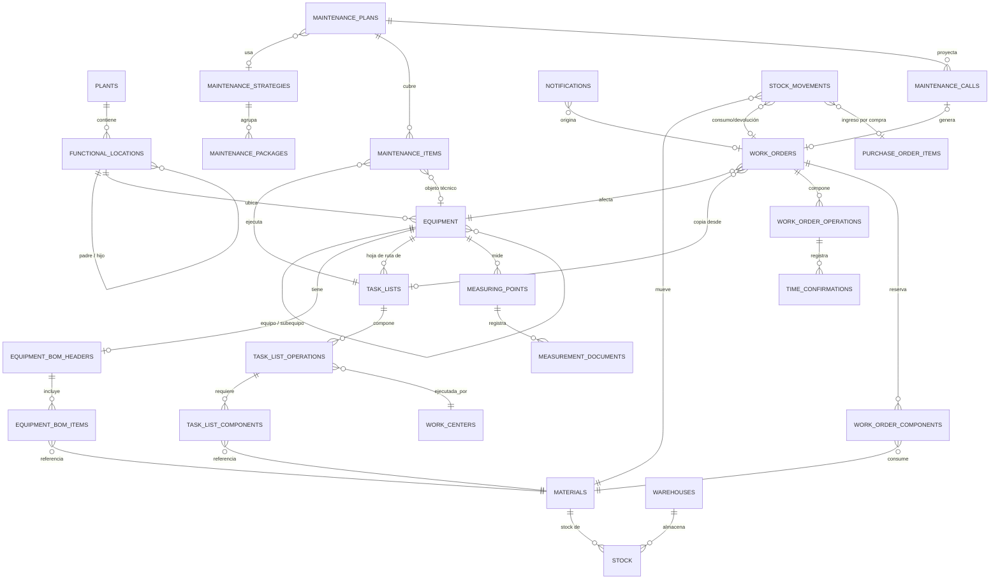

# 1. Modelo de Datos — CMMS/EAM

Esquema completo: [`../database/schema.sql`](../database/schema.sql) (validado ejecutándolo contra PostgreSQL 16, incluyendo un smoke test funcional de punta a punta).

## 1.1 Diagrama Entidad-Relación

> El diagrama muestra las relaciones estructurales. El detalle exacto de columnas, tipos, `CHECK` y `UNIQUE` está en el archivo SQL — es la fuente de verdad.

## 1.2 Mapeo funcional con SAP PM

| Entidad del sistema | Tabla | Objeto SAP PM equivalente |
|---|---|---|
| Ubicación Técnica | `functional_locations` | `IFLOT` |
| Equipo | `equipment` | `EQUI` / `EQUZ` |
| Lista de materiales del equipo | `equipment_bom_headers` / `equipment_bom_items` | `STKO` / `STPO` |
| Hoja de Ruta | `task_lists` / `task_list_operations` | `PLKO` / `PLPO` |
| Puesto de trabajo | `work_centers` | `CRHD` |
| Punto de medición / Lectura | `measuring_points` / `measurement_documents` | `IMPTT` / `IMRC` |
| Estrategia / Paquete de mantenimiento | `maintenance_strategies` / `maintenance_packages` | `T351` / `T351P` |
| Plan de Mantenimiento | `maintenance_plans` | `MPLA` |
| Ítem de mantenimiento (objeto del plan) | `maintenance_items` | `MPOS` |
| Llamado / simulación de plan | `maintenance_calls` | Log de fechas de llamada (sin tabla visible en SAP; equivalente a la tabla interna de programación) |
| Aviso | `notifications` | `QMEL` / `QMIH` (tipos M1/M2/M3) |
| Orden de Trabajo | `work_orders` | `AUFK` / `CAUFVD` |
| Operación de la Orden | `work_order_operations` | `AFVC` |
| Reserva de materiales | `work_order_components` | `RESB` |
| Confirmación de tiempo | `time_confirmations` | `AFRU` |
| Movimiento de mercadería | `stock_movements` | `MSEG` / `MKPF` (tipos de movimiento 101, 261, 262, 311...) |

## 1.3 La cadena crítica: Plan → Hoja de Ruta → Orden → Repuestos

Este es el flujo que garantiza que el mantenimiento preventivo se genere de forma consistente, y está resuelto a nivel de base de datos (no solo de aplicación) mediante triggers:

1. **`maintenance_plans`** define *cuándo* debe dispararse un mantenimiento (por tiempo o por contador), con su tolerancia (`shift_factor_*`) y horizonte de llamado (`call_horizon_pct`).
2. **`maintenance_items`** conecta el plan con **un objeto técnico concreto** (`equipment_id` o `functional_location_id`) y, obligatoriamente, con **una `task_list_id`** — la hoja de ruta que define *qué* hacer.
3. **`task_list_operations`** + **`task_list_components`** definen las tareas paso a paso y los repuestos necesarios para cada paso, ya con especialidad (`work_center_id`) y tiempos estimados.
4. El **motor de simulación** (ver [`04-motor-simulacion.md`](04-motor-simulacion.md)) lee los planes activos y escribe filas de proyección en **`maintenance_calls`** — esta tabla es el calendario prospectivo (simulación) y, a la vez, el histórico de llamados reales.
5. Cuando un llamado entra en su horizonte de generación, el backend inserta una fila en **`work_orders`** con `task_list_id` heredado del `maintenance_item` y `origin_maintenance_call_id` apuntando al llamado.
6. El trigger `trg_wo_from_task_list` **copia automáticamente** las operaciones (`work_order_operations`) y los componentes (`work_order_components`) desde la hoja de ruta hacia la orden recién creada — replicando el comportamiento de SAP al "liberar" una orden desde un plan.
7. Al confirmar consumo de materiales (`stock_movements` con `GI_261_CONSUMPTION`), el trigger `trg_stock_movement` descuenta el stock físico y actualiza el estado de la reserva (`work_order_components.status`) automáticamente.
8. Al confirmar horas (`time_confirmations`), el trigger `trg_time_confirmation` acumula `duration_actual` en la operación, insumo para el cálculo de KPIs (MTTR, cumplimiento de horas planificadas vs. reales).

Esto significa que la integridad **Plan → Hoja de Ruta → Orden → Repuestos** no depende de que el código de aplicación "recuerde" copiar todo correctamente: está garantizada por la base de datos. La capa de servicios solo necesita `INSERT` en el punto correcto de la cadena.

## 1.4 Notas de diseño

- **Jerarquía de ubicaciones técnicas**: se modela con lista de adyacencia (`parent_id`) + `materialized_path` mantenido por trigger, lo que permite consultas de subárbol eficientes (`WHERE materialized_path LIKE 'root.hijo%'`) sin recursión en cada lectura. Para volúmenes muy grandes, se puede migrar a la extensión `ltree` de PostgreSQL sin cambiar el modelo lógico.
- **Planes multi-ciclo (estrategias)**: igual que en SAP, un plan puede usar una `maintenance_strategy` que combina varios `maintenance_packages` (ej. 1M/3M/6M/1A) sobre el mismo equipo. El motor de simulación combina llamados que caen dentro de la ventana de tolerancia en una sola orden, evitando paradas redundantes.
- **Búsqueda de texto parcial**: los campos de descripción llevan índices `GIN` con `pg_trgm`, habilitando `ILIKE '%patrón%'` performante para las grillas tipo Excel del frontend.
- **Trazabilidad de costos**: cada orden, centro de trabajo y equipo apunta a un `cost_center_id`, lo que permite reportes de costo de mantenimiento por área sin joins adicionales.
- **Extensibilidad a compras**: `purchase_requisitions` → `purchase_orders` → `stock_movements` (tipo `GR_101_PURCHASE`) cierran el ciclo de reposición cuando `stock.quantity_on_hand <= stock.reorder_point`.
