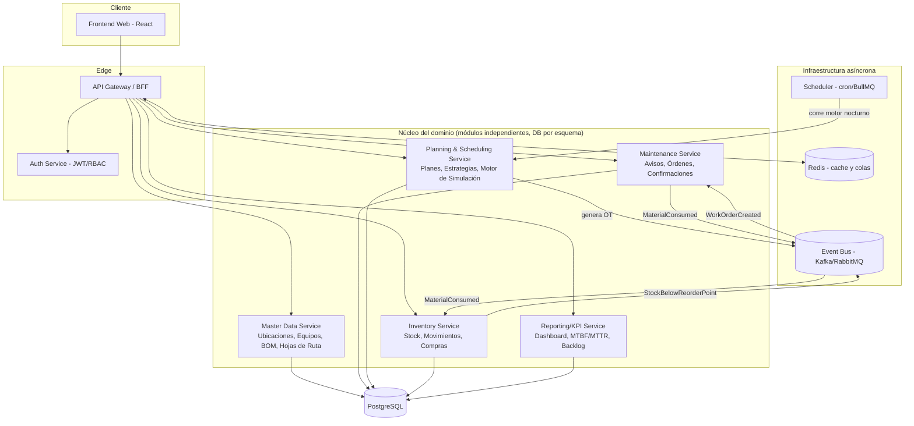

# 2. Arquitectura de Backend

## 2.1 Enfoque: microservicios modulares por dominio funcional

Se recomienda **no** partir con microservicios físicamente separados desde el día uno. En su lugar: un **monolito modular** (módulos con límites de dominio estrictos, cada uno con su propio esquema de base de datos lógico) que puede escindirse en servicios independientes cuando el volumen lo justifique. Esto evita la complejidad operativa prematura (orquestación, transacciones distribuidas) mientras se preserva la separación de responsabilidades.



### Cuándo separar en servicios físicos reales
- **Inventory Service**: es el primer candidato a separarse si se integra con un ERP de compras externo (ej. SAP MM real, u otro sistema de abastecimiento).
- **Reporting/KPI Service**: candidato a separarse si los dashboards requieren un motor OLAP (ej. réplica a ClickHouse/BigQuery) para no impactar la base transaccional.
- El resto (Master Data, Maintenance, Planning) comparten transacciones estrechamente acopladas (ver la cadena Plan→Orden→Componentes del documento de modelo de datos) y conviene mantenerlos en el mismo proceso/DB mientras el equipo sea pequeño.

## 2.2 Stack tecnológico recomendado

| Capa | Tecnología | Justificación |
|---|---|---|
| Lenguaje/Framework backend | **Node.js + NestJS (TypeScript)** | Estructura modular nativa (`@Module`), inyección de dependencias, ideal para mapear el diseño por dominios. Alternativa equivalente: Java + Spring Boot. |
| ORM | **Prisma** (o TypeORM) | Migraciones versionadas y tipado end-to-end a partir del schema SQL. |
| Base de datos | **PostgreSQL 15+** | Soporta jerarquías, JSONB, triggers PL/pgSQL (usados para la integridad Plan→Orden), y `pg_trgm` para búsqueda parcial. |
| Cache / colas | **Redis** | Cache de catálogos (equipos, materiales) y backend de colas (BullMQ) para jobs programados. |
| Mensajería de eventos | **RabbitMQ** (equipos medianos) o **Kafka** (alto volumen / múltiples consumidores) | Desacopla Planning→Maintenance→Inventory sin transacciones distribuidas síncronas. |
| Autenticación | **JWT + refresh tokens**, RBAC por rol (`ADMIN`, `PLANNER`, `TECHNICIAN`) | Mapea 1:1 con el enum `user_role` del esquema. |
| API | **REST** como interfaz pública (contratos simples, cacheable) + **GraphQL opcional** en un BFF para las vistas de grilla que necesitan combinar/paginar múltiples entidades con filtros dinámicos | Ver 2.4. |
| Documentación de API | **OpenAPI 3 (Swagger)** autogenerado por NestJS | Contrato consumible por el frontend y por QA. |
| Contenerización | **Docker** + **Docker Compose** (dev) / **Kubernetes** (prod) | Despliegue reproducible por módulo. |
| Observabilidad | OpenTelemetry + Prometheus/Grafana, logs estructurados (Pino) | Trazar el pipeline asíncrono Plan→OT→Stock. |

## 2.3 API REST — recursos principales

Convención: `/api/v1/<recurso>`. Todas las respuestas de listado son paginadas (`?page`, `?pageSize`) y soportan filtros dinámicos vía query params (`?status=IN_PROCESS&equipmentId=...&search=...`) para alimentar las grillas tipo Excel del frontend.

| Método | Endpoint | Descripción |
|---|---|---|
| `GET/POST` | `/functional-locations` | Árbol de ubicaciones técnicas (soporta `?parentId=` y `?flat=true` para la grilla) |
| `GET/POST/PATCH` | `/equipment` | CRUD de equipos; `GET /equipment/:id/bom` para su lista de repuestos |
| `GET/POST` | `/materials` | Maestro de repuestos |
| `GET/POST` | `/task-lists` | Hojas de ruta; `POST /task-lists/:id/operations` para agregar pasos |
| `GET/POST` | `/maintenance-plans` | CRUD de planes; incluye `cycleValue/cycleUnit` o `strategyId` |
| `POST` | `/maintenance-plans/:id/items` | Asocia el plan a un equipo/ubicación + hoja de ruta |
| `POST` | `/maintenance-plans/simulate` | **Dispara el motor de simulación** para un horizonte dado (ver 2.3.1) |
| `GET` | `/maintenance-calls?from=&to=&status=` | Calendario de llamados (para Gantt/calendario) |
| `POST` | `/maintenance-calls/:id/release` | Convierte un llamado simulado en Orden de Trabajo real |
| `GET/POST` | `/notifications` | Avisos (correctivo); `PATCH /notifications/:id/status` |
| `GET/POST` | `/work-orders` | Órdenes de trabajo; `POST /work-orders` desde aviso o manual |
| `PATCH` | `/work-orders/:id/release` \| `/complete` \| `/close` | Transiciones de estado |
| `POST` | `/work-orders/:id/time-confirmations` | Notificación de horas del técnico |
| `POST` | `/work-orders/:id/components/:componentId/withdraw` | Consumo de repuesto (genera `stock_movement`) |
| `GET/POST` | `/warehouses`, `/stock`, `/stock-movements` | Inventario |
| `GET` | `/stock?belowReorderPoint=true` | Insumo para reposición automática |
| `GET` | `/dashboard/kpis` | Backlog, % cumplimiento preventivo, MTBF/MTTR, disponibilidad |
| `GET` | `/export/:resource?format=csv\|xlsx&...filtros` | Exportación masiva respetando los filtros activos de la grilla |

### 2.3.1 Ejemplo — disparar la simulación

```http
POST /api/v1/maintenance-plans/simulate
Content-Type: application/json

{
  "planIds": ["dddddddd-...-dddd"],   // opcional: vacío = todos los planes activos
  "horizonMonths": 12
}
```

```json
{
  "generatedCalls": 24,
  "calendar": [
    { "planId": "dddddddd-...", "callNumber": 5, "scheduledDate": "2026-09-29", "withinCallHorizon": false },
    { "planId": "dddddddd-...", "callNumber": 6, "scheduledDate": "2026-10-29", "withinCallHorizon": false }
  ]
}
```

El servicio persiste cada fila en `maintenance_calls` con `status = 'SIMULATED'`. Un segundo endpoint/job promueve a `work_orders` los llamados cuya fecha entra en el horizonte de generación (ver documento 4).

## 2.4 REST vs. GraphQL

- **REST** para operaciones transaccionales (crear orden, confirmar horas, mover stock): comandos claros, cacheables, fáciles de versionar y de asegurar con permisos por endpoint.
- **GraphQL** (opcional) para las **vistas de grilla avanzadas**: el frontend necesita combinar equipo + ubicación + último aviso + próximo plan en una sola consulta con filtros y ordenamiento arbitrarios; GraphQL evita construir N endpoints REST a medida para cada combinación de columnas visibles. Se implementa como una capa BFF de solo lectura sobre los mismos servicios, sin duplicar lógica de negocio.

## 2.5 Seguridad y roles

RBAC de tres roles mínimos (extensible), verificado en el Gateway y reforzado a nivel de servicio:

| Rol | Permisos clave |
|---|---|
| **Administrador** | Acceso total, incluida configuración de estrategias/calendarios y gestión de usuarios. |
| **Planificador** | CRUD de planes, hojas de ruta, aprobación/liberación de OTs, gestión de compras y punto de pedido. |
| **Técnico** | Solo lectura de OTs asignadas a su `work_center`, notificación de horas propias, consumo de materiales de sus OTs. |

Los permisos se implementan como *guards* NestJS (`@Roles('PLANNER')`) más un filtro de fila a nivel de query (un técnico solo ve `work_orders` donde `work_center_responsible_id` coincide con su `work_center_id`).

## 2.6 Motor de simulación como job asíncrono

El motor (detallado en el documento 4) no corre en el hilo de la request HTTP para horizontes largos (6-12 meses × todos los planes activos). Se ejecuta:
1. **Bajo demanda**: `POST /maintenance-plans/simulate` para recalcular al vuelo tras editar un plan (horizonte corto, respuesta síncrona).
2. **Programado**: job nocturno (`BullMQ` + `cron`) que recalcula el calendario completo y promueve a `work_orders` los llamados que entraron en horizonte — equivalente al **runner de fondo de SAP (transacción IP30)**.
