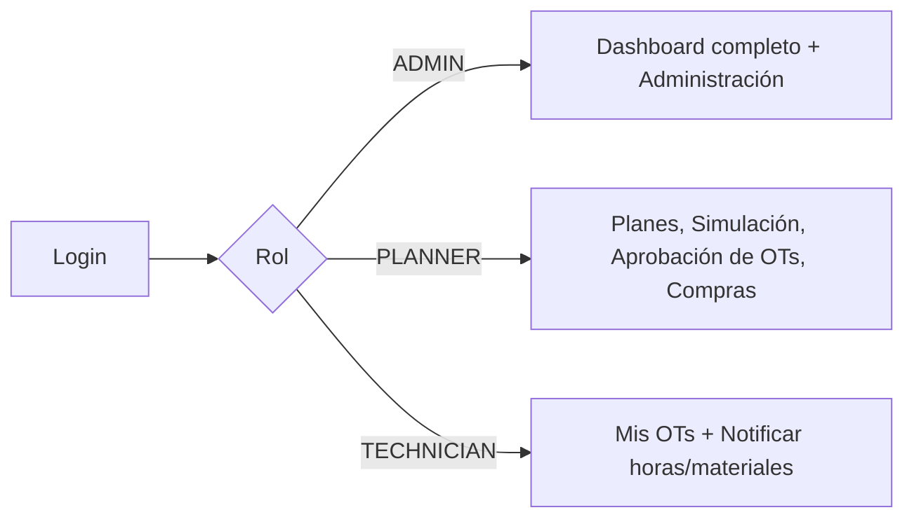

# 3. Arquitectura de Frontend

## 3.1 Stack recomendado

| Necesidad | Elección | Motivo |
|---|---|---|
| Framework | **React 18 + TypeScript**, bundler **Vite** | Estándar de facto, tipado compartido con el backend (contratos generados desde OpenAPI). |
| Estado de servidor | **TanStack Query (React Query)** | Cache, invalidación y refetch automático tras mutaciones (ej. al liberar una OT, refresca el listado). |
| Estado de UI local | **Zustand** | Filtros activos de grilla, selección de filas, estado del wizard de creación de OT — sin el boilerplate de Redux. |
| Grillas de datos (estilo Excel) | **AG Grid Community** (o TanStack Table + virtualización si se prioriza bundle size) | Filtros por columna, multi-ordenamiento, edición inline, y exportación a CSV/Excel nativas. |
| Gantt / calendario de simulación | **frappe-gantt** o **dhtmlx-gantt** (licenciado) para el Gantt; grilla de calendario propia (basada en `date-fns`) para la vista mensual | Visualizar OTs proyectadas vs. liberadas en una línea de tiempo. |
| Formularios | **React Hook Form + Zod** | Validación tipada compartida entre formulario y contrato de API. |
| Enrutamiento | **React Router** con *route guards* por rol | `/tecnico/*` solo accesible para `TECHNICIAN`, etc. |
| Estilos | **Tailwind CSS** + componentes base tipo shadcn/ui | Velocidad de desarrollo, consistencia visual. |

## 3.2 Estructura de carpetas

```
src/
├── app/                        # bootstrap, providers, router
│   ├── routes.tsx
│   └── providers/ (QueryClient, AuthProvider, ThemeProvider)
├── modules/
│   ├── master-data/
│   │   ├── functional-locations/   # árbol + grilla
│   │   ├── equipment/              # listado, ficha, garantía, BOM
│   │   ├── materials/
│   │   └── task-lists/             # editor de hojas de ruta (operaciones + repuestos)
│   ├── maintenance-plans/
│   │   ├── plan-editor/            # ciclo único o estrategia multi-paquete
│   │   ├── simulation/             # Gantt + calendario de llamados proyectados
│   │   └── strategies/
│   ├── notifications/              # avisos correctivos
│   ├── work-orders/
│   │   ├── list/                   # grilla principal de OTs
│   │   ├── detail/                 # operaciones, componentes, confirmaciones
│   │   └── technician-view/        # vista simplificada "Mis OTs"
│   ├── inventory/
│   │   ├── stock/
│   │   ├── movements/
│   │   └── purchasing/
│   └── dashboard/
│       ├── kpi-cards/              # Backlog, %Cumplimiento, MTBF, MTTR
│       └── charts/
├── shared/
│   ├── components/
│   │   ├── DataGrid/                # wrapper de AG Grid: filtros, export, búsqueda parcial
│   │   ├── GanttChart/
│   │   ├── StatusBadge/
│   │   └── RoleGuard/
│   ├── hooks/ (useDebouncedSearch, useExport, usePermissions)
│   └── api/ (cliente HTTP generado desde OpenAPI, uno por módulo)
└── styles/
```

## 3.3 El componente `DataGrid` — grillas estilo Excel

Requisito explícito: filtros múltiples, ordenamiento, búsqueda por texto parcial (patrones), exportación masiva. Se centraliza en un único wrapper reutilizable para no reimplementar esto en cada pantalla:

```tsx
// shared/components/DataGrid/DataGrid.tsx
import { AgGridReact } from 'ag-grid-react';
import { useMemo, useState } from 'react';

interface DataGridProps<T> {
  rows: T[];
  columns: ColDef<T>[];
  onExport?: (format: 'csv' | 'xlsx') => void;
  quickSearchPlaceholder?: string;
}

export function DataGrid<T>({ rows, columns, onExport, quickSearchPlaceholder }: DataGridProps<T>) {
  const [quickFilter, setQuickFilter] = useState('');

  // Búsqueda por texto parcial / patrón: se apoya en el operador ILIKE del backend
  // para datasets grandes (server-side filtering) y en el quickFilterText de AG Grid
  // para refinar en cliente sobre la página ya cargada.
  const defaultColDef = useMemo(() => ({
    sortable: true,
    filter: true,          // habilita filtro por columna (texto, número, fecha, set)
    floatingFilter: true,  // barra de filtro visible bajo el header, como Excel
    resizable: true,
  }), []);

  return (
    <div className="flex flex-col gap-2">
      <div className="flex justify-between">
        <input
          placeholder={quickSearchPlaceholder ?? 'Buscar (admite * como comodín)...'}
          value={quickFilter}
          onChange={(e) => setQuickFilter(e.target.value)}
          className="border rounded px-2 py-1 w-72"
        />
        <div className="flex gap-2">
          <button onClick={() => onExport?.('csv')}>Exportar CSV</button>
          <button onClick={() => onExport?.('xlsx')}>Exportar Excel</button>
        </div>
      </div>
      <AgGridReact
        rowData={rows}
        columnDefs={columns}
        defaultColDef={defaultColDef}
        quickFilterText={quickFilter}
        pagination
        paginationPageSize={50}
        rowSelection="multiple"
      />
    </div>
  );
}
```

**Búsqueda por patrón sobre datasets grandes**: cuando el listado excede lo paginado en cliente (miles de equipos/OTs), el `quickFilter` se debe traducir a un query param `?search=` que el backend resuelve con `ILIKE '%término%'` apoyado en los índices `GIN + pg_trgm` del esquema (ver `01-modelo-datos.md`), evitando escaneos secuenciales.

**Exportación masiva**: el botón "Exportar" nunca exporta solo lo que está renderizado en pantalla — llama a `GET /export/:resource?format=xlsx&<mismos filtros activos>` para que el backend genere el archivo completo (streaming), evitando cargar todo el dataset en el navegador.

## 3.4 Vista de Simulación (Gantt + Calendario)

- **Modo Gantt**: eje X = tiempo (6-12 meses), eje Y = equipo/línea. Cada barra es un `maintenance_call`; color por `status` (`SIMULATED` gris, `SCHEDULED` azul, `CALLED`/OT liberada verde, `COMPLETED` verde oscuro). Permite arrastrar para re-planificar manualmente (llama a `PATCH /maintenance-calls/:id`).
- **Modo Calendario/grilla mensual**: vista tipo Excel con una fila por equipo y una columna por semana/mes, mostrando el conteo de llamados proyectados — útil para planificar capacidad de cuadrillas.
- Ambas vistas consumen el mismo endpoint `GET /maintenance-calls?from=&to=`, así que el motor de simulación (backend) es la única fuente de verdad — el frontend solo renderiza.

## 3.5 Roles y navegación



- `RoleGuard` envuelve rutas y también oculta acciones (botones "Aprobar", "Editar plan") que el rol actual no puede ejecutar, aunque la autorización real siempre se revalida en el backend.
- La vista de Técnico es deliberadamente reducida (lista de sus OTs, detalle con checklist de operaciones, formulario de horas y consumo) para uso en tablet/planta.

## 3.6 Dashboard de KPIs

Cards alimentadas por `GET /dashboard/kpis`, que internamente consulta las vistas SQL `vw_maintenance_backlog`, `vw_preventive_compliance`, `vw_mtbf_by_equipment`, `vw_mttr_by_equipment` y `vw_equipment_availability` definidas en el esquema:

- **Backlog de Mantenimiento**: cantidad y antigüedad de OTs vencidas (`days_overdue`), con drill-down a la grilla filtrada.
- **Cumplimiento del Plan Preventivo (%)**: serie mensual, gráfico de línea.
- **MTBF / MTTR y Disponibilidad**: por equipo, con ranking de los equipos más críticos (ordenable, exportable — reutiliza el `DataGrid`).
