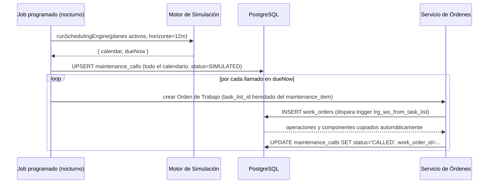

# 4. Motor de Simulación de Planes de Mantenimiento

Implementación: [`../backend/simulation-engine/simulation-engine.ts`](../backend/simulation-engine/simulation-engine.ts)
Ejemplos ejecutables: [`../backend/simulation-engine/simulation-engine.smoke-test.ts`](../backend/simulation-engine/simulation-engine.smoke-test.ts)

Este es el componente que responde al requerimiento *"un motor que lea los Planes de Mantenimiento y genere un calendario prospectivo para los próximos 6 o 12 meses"*. Fue implementado y **verificado ejecutándolo** (compilado con `tsc --strict` y corrido con Node.js) contra tres escenarios reales: plan por tiempo, plan por contador y plan de estrategia multi-ciclo.

## 4.1 Conceptos (equivalentes a SAP PM)

| Concepto | Campo en `maintenance_plans` | Significado |
|---|---|---|
| Ciclo | `cycle_value` + `cycle_unit` | Cada cuánto se repite el mantenimiento (30 días, 6 meses, 10.000 horas). |
| Fecha/contador de arranque | `start_date` / ancla inicial | Punto de partida de la primera proyección si aún no hay historial. |
| Ancla del último llamado | `last_call_date` / `last_call_counter` | Una vez ejecutado un ciclo, el próximo se calcula **desde la última ejecución real**, no desde el plan original — evita "arrastre" de fechas cuando una OT se demora. |
| Factor de desplazamiento (*shift factor*) | `shift_factor_early_pct` / `shift_factor_late_pct` | Tolerancia de adelanto/atraso antes de considerar el llamado "vencido" o de fusionarlo con otro paquete cercano. |
| Horizonte de llamado (*call horizon*) | `call_horizon_pct` | % del ciclo que debe transcurrir antes de generar la Orden de Trabajo real. Un plan mensual con horizonte 90% genera la OT cuando faltan ~3 días para la fecha (10% de 30 días). |
| Estrategia y paquetes | `maintenance_strategies` / `maintenance_packages` | Un mismo plan combina varios ciclos (1M, 3M, 6M, 1A); el motor debe evitar generar órdenes redundantes cuando dos paquetes vencen casi simultáneamente. |

## 4.2 Algoritmo — planes por tiempo (`simulateTimeBasedPlan`)

1. Se toma como ancla la fecha del último llamado real (`lastCallDate`) o, si el plan es nuevo, `startDate`.
2. Se generan fechas sucesivas sumando el ciclo (`addCycle`) hasta superar el horizonte de proyección (`horizonMonths`).
3. Para cada fecha proyectada se calcula la **fecha de disparo del horizonte de llamado**: `fecha_llamado − duración_ciclo × (1 − callHorizonPct/100)`.
4. Si `today >= fecha_disparo_horizonte`, el llamado se marca `shouldGenerateNow = true` — la capa de aplicación lo debe promover a Orden de Trabajo.

```
Ciclo: 30 días · último llamado real: 2026-07-30 · horizonte de llamado: 90%
  → dispara cuando falta el 10% del ciclo (≈3 días)

  Llamado 1: 2026-08-29  → fecha de disparo: 2026-08-26  → hoy=2026-08-28 ⇒ shouldGenerateNow = true
  Llamado 2: 2026-09-28  → fecha de disparo: 2026-09-25  → hoy=2026-08-28 ⇒ shouldGenerateNow = false
```

Esto es exactamente lo que valida el smoke test: el llamado del 29-ago se marca para generar orden ya (dado que hoy es 28-ago), y el del 28-sep todavía no.

## 4.3 Algoritmo — planes por contador (`simulateCounterBasedPlan`)

Los planes por rendimiento (horas de uso, kilómetros) no tienen una fecha fija: dependen de cuánto se usa el equipo. El motor:

1. Estima la **tasa de uso diaria** (`estimateDailyUsageRate`) a partir del historial de `measurement_documents` — diferencia entre la primera y la última lectura, dividida por los días transcurridos (regresión lineal simple; con más lecturas se puede sofisticar a mínimos cuadrados sin cambiar la interfaz).
2. Proyecta el **contador de vencimiento** del próximo llamado: `último_contador_de_llamado + cycleValue`.
3. Convierte ese contador objetivo a una **fecha estimada**, usando la tasa de uso: `fecha = última_lectura + (contador_objetivo − última_lectura) / tasa_diaria`.
4. Repite mientras la fecha estimada caiga dentro del horizonte de proyección.
5. Determina `shouldGenerateNow` comparando el **contador estimado a hoy** contra el umbral de horizonte de llamado (mismo criterio porcentual que en tiempo, pero aplicado al contador en vez de a los días).

Ejemplo validado: un equipo que acumula ~19,7 horas/día, con último service a las 20.000 hs y ciclo de 10.000 hs, proyecta el próximo vencimiento a las 30.000 hs para aproximadamente el **2 de abril de 2027** — y aún no dispara la generación de la orden porque falta más del margen de horizonte configurado.

> Si en el futuro se dispone de telemetría en tiempo real (IoT), `estimateDailyUsageRate` se reemplaza por la lectura instantánea sin tocar el resto del motor — es una función pura, aislada por diseño.

## 4.4 Algoritmo — estrategias multi-ciclo (`simulateStrategyPlan`)

1. Se simula cada paquete (`1M`, `3M`, `6M`...) de forma independiente con `simulateTimeBasedPlan`.
2. Se combinan todas las fechas y se ordenan cronológicamente.
3. Se recorren en orden: si un llamado cae dentro de la **tolerancia de atraso** (`shiftFactorLatePct` del ciclo del paquete) respecto del llamado anterior ya aceptado, se **fusionan** — se conserva la fecha más temprana y se acumulan las claves de paquete combinadas (`packageKeysCombined`).
4. El resultado es un calendario donde, por ejemplo, el llamado trimestral (3M) que coincide con un llamado mensual (1M) genera **una sola Orden de Trabajo** que incluye las tareas de ambas hojas de ruta, evitando parar el equipo dos veces en la misma semana — el mismo comportamiento que la programación de estrategias en SAP PM.

Validado en el smoke test: sobre 4 meses, los paquetes 1M y 3M se fusionan correctamente cada vez que coinciden (mes 3, 6, 9...), quedando marcados como `paquetes: ['1M', '3M']`.

## 4.5 Orquestador (`runSchedulingEngine`)

Punto de entrada único que:
1. Recorre todos los planes activos (mezcla de tipos: tiempo, contador, estrategia).
2. Delega en la función de simulación correspondiente según `planType`.
3. Devuelve **`calendar`** (todo el calendario proyectado, para alimentar el Gantt/vista de calendario del frontend) y **`dueNow`** (el subconjunto que ya debe convertirse en Orden de Trabajo).

```ts
const { calendar, dueNow } = runSchedulingEngine(activePlans, {
  today: new Date(),
  horizonMonths: 12,
  counterReadingsByPlanId: readingsIndexedByPlan,
});

// calendar  -> persistir/actualizar en la tabla maintenance_calls (status SIMULATED)
// dueNow    -> para cada uno: INSERT INTO work_orders (..., task_list_id, origin_maintenance_call_id)
//              el trigger SQL trg_wo_from_task_list hace el resto (copia operaciones y componentes)
```

## 4.6 Integración con el resto del sistema



De esta manera, el motor de simulación es **puro y testeable de forma aislada** (sin tocar la base de datos, como demuestra el smoke test), mientras que la persistencia y la generación real de órdenes quedan a cargo de la capa de aplicación + los triggers SQL descritos en `01-modelo-datos.md`.

## 4.7 Cómo correr el smoke test

```bash
cd cmms-pm-architecture/backend/simulation-engine
npm install --no-save typescript @types/node
npx tsc --target ES2020 --module commonjs --strict --types node --outDir /tmp/dist simulation-engine.ts simulation-engine.smoke-test.ts
node /tmp/dist/simulation-engine.smoke-test.js
```

Salida esperada: todas las aserciones en `OK`, calendario impreso para los tres tipos de plan, y `SMOKE TEST: TODO OK` al final.
